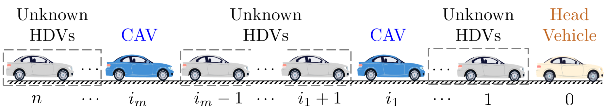
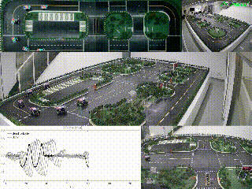

# Demos for DeeP-LCC
In this project, we present a few demos of DeeP-LCC for Cooperative Control of Connected and Autonomous Vehicles (CAVs) in mixed traffic. 

**See our experimental validation on [youtube](https://www.youtube.com/watch?v=ZZ2cWhapqpc).**

## Data-EnablEd Predictive Leading Cruise Control (DeeP-LCC)
DeeP-LCC is a data-driven predictive control strategy for CAVs in mixed traffic, where human-driven vehicles (HDVs) also exist. Our strategy aims to deal with unknown nonlinear car-following behaviors of HDVs. 

Insead of assuming a parametric car-following model, DeeP-LCC directly relies on measurable driving data to achieve safe and optimal control for CAVs. It is adapted from the standard [Data-EnablEd Predictive Control (DeePC)](https://ieeexplore.ieee.org/abstract/document/8795639/) method considering the characteristics of mixed traffic. DeeP-LCC is implemented in a receding horizon manner, in which input/output constraints are incorporated to achieve collision-free guarantees. 

Related projects: 

1. [Leading Cruise Control (LCC)](https://github.com/soc-ucsd/LCC)
2. [Mixed-traffic](https://github.com/soc-ucsd/mixed-traffic)

## Data Collection
DeeP-LCC collects three types of trajectory data from mixed traffic:

1. **Control input** : acceleration signal of the CAVs;
2. **Traffic output** : velocity error of all the following vehicles (including HDVs and CAVs), and spacing error of the CAVs;
3. **External input** : velocity error of the had vehicle.

## Optimization Formulation

The following optimization problem is converted to quadratic programming for problem solving, and is implemented in a receding horizon manner.

# Experimental Validation

**A. Straight road experiments ([youtube link](https://www.youtube.com/watch?v=ZZ2cWhapqpc)).**

Case 1: all the vehicles are HDVs.

Case 2: Vehicle no.2 utilizes DeeP-LCC.

Case 3: Vehicles no.2 and no.4 utilize DeeP-LCC.

## Contact us
To contact us about Deep-LCC, email either [Jiawei Wang](mailto:wang-jw18@mails.tsinghua.edu.cn?Subject=DeeP-LCC) or [Yang Zheng](mailto:zhengy@eng.ucsd.edu?Subject=DeeP-LCC).

